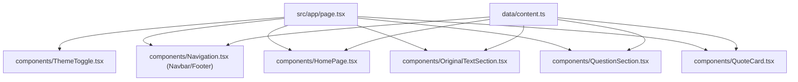

# Code Wiki｜maoxuan-web

> 基于《毛泽东选集》的在线学习平台（Day 1《实践论》）。该仓库为纯前端项目：静态内容（本地常量）+ React 组件渲染 + 少量前端交互；无后端服务、无数据库、无 API 路由。

## 1. 项目概览

- 项目形态：Next.js 14 App Router 单页式学习页面（`/` 路由聚合多个 section）。
- 主要目标：以结构化的“课程信息 / 原文精读 / 思考题 / 金句卡片”形式展示学习内容，并提供暗色模式与基础交互。

## 2. 技术栈与依赖

### 2.1 核心技术栈

- Next.js 14（App Router）
- React 18
- TypeScript
- Tailwind CSS（暗色模式采用 `class` 方案）

### 2.2 关键依赖（package.json）

- `next@14.2.5`
- `react@^18`
- `react-dom@^18`

### 2.3 脚本命令

- `npm run dev`：本地开发（Next dev server）
- `npm run build`：生产构建
- `npm run start`：生产启动（基于 `.next` 构建产物）
- `npm run lint`：ESLint（Next 推荐规则集）

## 3. 目录结构

```
.
├── src/
│   ├── app/
│   │   ├── globals.css        # 全局样式（Tailwind + 自定义）
│   │   ├── layout.tsx         # RootLayout + Metadata
│   │   └── page.tsx           # 首页路由（/）入口
│   ├── components/
│   │   ├── HomePage.tsx
│   │   ├── Navigation.tsx
│   │   ├── OriginalTextSection.tsx
│   │   ├── QuestionSection.tsx
│   │   ├── QuoteCard.tsx
│   │   ├── ThemeToggle.tsx
│   │   └── index.ts           # 组件聚合导出
│   └── data/
│       ├── content.ts         # 站点静态内容（核心数据源）
│       └── index.ts           # 数据聚合导出
├── README.md
├── package.json
├── tsconfig.json              # TS 配置 + 路径别名
├── next.config.js
├── tailwind.config.js
├── postcss.config.js
└── .eslintrc.json
```

## 4. 整体架构与运行时流程

### 4.1 App Router 入口链路

- `src/app/layout.tsx`
  - 定义 `metadata`（页面标题与描述）
  - 定义 `RootLayout`，提供 `<html lang="zh-CN">`、`<meta viewport>` 和 `<body className="antialiased">`
- `src/app/page.tsx`
  - 默认导出 `Page()` 作为 `/` 路由渲染入口
  - 组装页面组件：`ThemeToggle`（固定悬浮） + `Navbar`（吸顶导航） + 主体 sections + `Footer`

整体渲染结构（抽象）：

```
RootLayout
  └── Page (/)
      ├── ThemeToggle
      ├── Navbar
      ├── Main
      │   ├── HomePage
      │   ├── OriginalTextSection
      │   ├── QuestionSection
      │   └── QuoteCard
      └── Footer
```

### 4.2 数据流（静态内容 → 组件渲染）

- 该项目没有请求远端 API 的逻辑；所有内容均维护在 `src/data/content.ts`。
- 组件通过 ES Module import 直接读取常量（对象/数组），在 render 中 `map()` 生成 UI。

典型模式：

- 数据：`export const questions = [...]`
- 组件：`questions.map((q) => ...)`

### 4.3 交互状态（UI 逻辑）

该项目的交互全部在客户端组件中完成（文件顶部 `use client`），主要状态包括：

- 主题切换：`ThemeToggle` 读取/写入 `localStorage.theme`，并切换 `document.documentElement.classList` 的 `dark` 类。
- 原文精读：
  - `expandedId`：当前展开的原文段落
  - `activeDimension`：现实启发的维度 tab（work/study/family/education）
- 思考题：`expandedId` 控制折叠展开
- 金句卡片：`flippedCards: Set<number>` 记录已翻面的卡片集合

## 5. 主要模块职责

### 5.1 `src/app`（路由与全局资源）

- `layout.tsx`：全局 HTML 框架与 Metadata
- `page.tsx`：首页路由入口，负责“页面装配（composition）”
- `globals.css`：全局样式；包含：
  - Tailwind base/components/utilities
  - `.prose-original`（原文排版）
  - `.quote-card` + `@keyframes fadeInUp`（金句卡片入场动画）
  - 滚动条样式

### 5.2 `src/data`（静态内容层）

- `content.ts`：站点内容唯一数据源，包含：
  - `courseInfo`：课程元信息
  - `teachingObjectives`：教学目标（knowledge/ability/quality）
  - `keyPoints`：重点与难点
  - `historicalBackground`：历史背景
  - `originalTextSections`：原文分段 + 多维度启发
  - `goldenQuotes`：金句卡片
  - `questions`：思考题（含参考答案）
- `index.ts`：数据聚合导出

### 5.3 `src/components`（展示与交互层）

- `ThemeToggle.tsx`：暗色模式切换（本地持久化）
- `Navigation.tsx`：导航与页脚（锚点跳转到各 section）
- `HomePage.tsx`：课程信息、教学目标、重点难点、历史背景
- `OriginalTextSection.tsx`：原文分段切换 + 启发维度 tab
- `QuestionSection.tsx`：思考题列表 + 折叠展开答案
- `QuoteCard.tsx`：金句卡片网格 + 翻面交互
- `components/index.ts`：组件聚合导出（便于 `@/components/...` 导入）

## 6. 关键组件与函数说明

> 该项目基本不使用 class；“关键类”主要体现在 React 组件与其内部函数（事件处理、状态转换）上。

### 6.1 `RootLayout`（src/app/layout.tsx）

- 职责：提供应用全局 HTML 骨架与元信息。
- 输入：`children: React.ReactNode`
- 输出：包含 `<html>` / `<head>` / `<body>` 的结构化页面外壳。

### 6.2 `Page`（src/app/page.tsx）

- 职责：作为 `/` 页面入口，负责组织各个 section 的展示顺序与分隔线（`<hr>`）。
- 关键点：
  - `ThemeToggle` 放置在最外层，使用 fixed 定位悬浮在右上角
  - `Navbar` 使用 sticky 实现吸顶

### 6.3 `ThemeToggle`（src/components/ThemeToggle.tsx）

- 职责：暗色模式开关 + 首次加载时从 `localStorage`/系统偏好推断主题。
- 状态：`theme: 'light' | 'dark'`
- 关键逻辑：
  - `useEffect`：读取 `localStorage.theme`，若无则读取 `prefers-color-scheme: dark`
  - `toggleTheme()`：写入 `localStorage` 并同步 `document.documentElement.classList`

### 6.4 `Navbar` / `Footer`（src/components/Navigation.tsx）

- 职责：
  - `Navbar`：提供页面锚点导航（`/#course-info`、`/#original-text`、`/#questions`、`/#quotes`）
  - `Footer`：展示课程日程信息（读取 `courseInfo.day/title`）

### 6.5 `HomePage`（src/components/HomePage.tsx）

- 职责：以“卡片”形式展示课程信息与结构化内容。
- 数据依赖：
  - `courseInfo`
  - `teachingObjectives.knowledge/ability/quality`
  - `keyPoints.focus/difficult`
  - `historicalBackground`
- 主要渲染方式：对数组 `map()` 渲染条目，并通过 Tailwind utility class 完成视觉层次。

### 6.6 `OriginalTextSection`（src/components/OriginalTextSection.tsx）

- 职责：原文分段精读组件，包含两级交互：
  1) 段落切换（分段导航按钮）
  2) 启发维度切换（work/study/family/education）
- 状态：
  - `expandedId: number | null`：当前显示的段落 id（初始为 `1`）
  - `activeDimension: 'work' | 'study' | 'family' | 'education'`
- 关键逻辑：
  - 分段导航：点击按钮 → `setExpandedId(section.id)`，通过 `block/hidden` 切换显示
  - 原文排版：`section.content.split('\n\n')` 进行段落分割并渲染 `<p>`
  - 启发展示：`section.enlightenment[activeDimension]` 按维度取值

### 6.7 `QuestionSection`（src/components/QuestionSection.tsx）

- 职责：展示“思考题与参考答案”，支持单条折叠展开。
- 状态：`expandedId: number | null`
- 关键逻辑：
  - 点击题目区域：`setExpandedId(expandedId === q.id ? null : q.id)`
  - 动画策略：通过 Tailwind class 切换 `max-h-*` 与 `opacity-*` 实现展开/收起过渡
  - 答案排版：`q.answer.split('\n\n')` 按段落渲染

### 6.8 `QuoteCard`（src/components/QuoteCard.tsx）

- 职责：金句网格 + 翻面卡片交互（正面显示金句，背面显示释义与提示）。
- 状态：`flippedCards: Set<number>`（记录已翻面卡片）
- 关键函数：`toggleFlip(id: number)`
  - 基于不可变更新策略：从 `prev` 拷贝出 `new Set(prev)` 再增删 id
- 动画与 3D：
  - 入场动画：`.quote-card` 应用 `fadeInUp`
  - 翻转：通过 `transform: rotateY(180deg)` + `backfaceVisibility: hidden` 模拟翻面

## 7. 数据模型（content.ts 概念结构）

该仓库没有显式定义 TS interface/type；数据结构可概括为：

- `courseInfo`
  - `day: number`
  - `title/subtitle/author/date/duration: string`
- `teachingObjectives`
  - `knowledge/ability/quality: string[]`
- `keyPoints`
  - `focus/difficult: string[]`
- `historicalBackground`
  - `time/location/significance: string`
  - `purpose: { title: string; content: string; errors: Array<{ name: string; desc: string }> }`
- `originalTextSections: Array<{
    id: number;
    title: string;
    content: string;
    enlightenment: { work: string; study: string; family: string; education: string };
  }>`
- `goldenQuotes: Array<{ id: number; quote: string; meaning: string; tip: string }>`
- `questions: Array<{ id: number; type: string; title: string; question: string; answer: string }>`

## 8. 依赖关系（模块层）

### 8.1 组件与数据依赖图



### 8.2 配置依赖关系

- Tailwind：
  - `tailwind.config.js` 定义 `darkMode: 'class'`，并扫描 `src/app|components|pages` 下文件生成样式。
  - `postcss.config.js` 注册 `tailwindcss` 与 `autoprefixer`。
- TypeScript：
  - `tsconfig.json` 配置路径别名：`@/* -> ./src/*`，用于 `@/components/...` 与 `@/data/...` 导入。
- ESLint：
  - `.eslintrc.json` 继承 `next/core-web-vitals`。

## 9. 运行与构建

### 9.1 环境要求（建议）

- Node.js：建议 18+（以 Next.js 14 生态为基准）
- 包管理器：npm（仓库 README 给出 npm 用法）

### 9.2 本地开发

```bash
npm install
npm run dev
```

浏览器访问 Next dev server 输出的地址（默认常见为 `http://localhost:3000`）。

### 9.3 生产构建与启动

```bash
npm run build
npm run start
```

### 9.4 代码质量

```bash
npm run lint
```

## 10. 常见扩展点（面向维护）

- 增加新的学习日（Day 2/3...）
  - 在 `src/data/content.ts` 中新增/拆分内容数据
  - 在 `src/app/page.tsx` 或新增路由（如 `src/app/day-2/page.tsx`）装配对应组件
- 国际化与多语言
  - 当前 `layout.tsx` 固定 `lang="zh-CN"`，可进一步引入 Next i18n 路由策略
- 数据维护方式升级
  - 当前为本地常量；若内容膨胀，可迁移到 Markdown/MDX 或引入 CMS/JSON 文件，并在构建时读取

